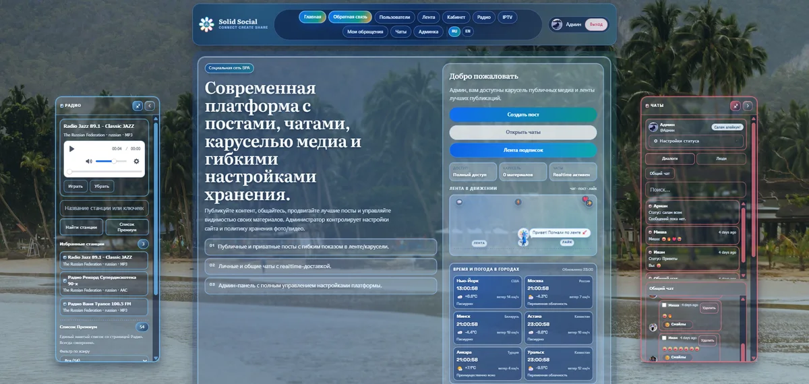
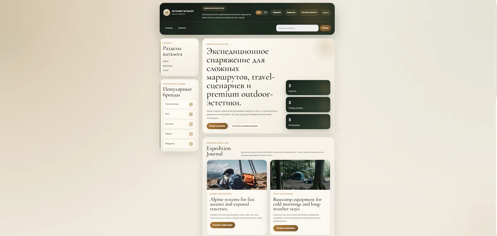
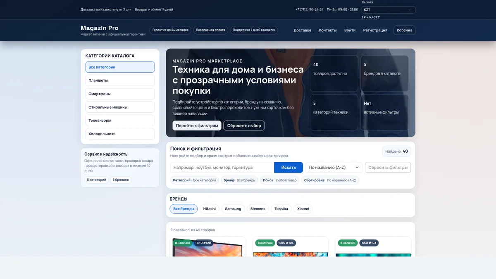
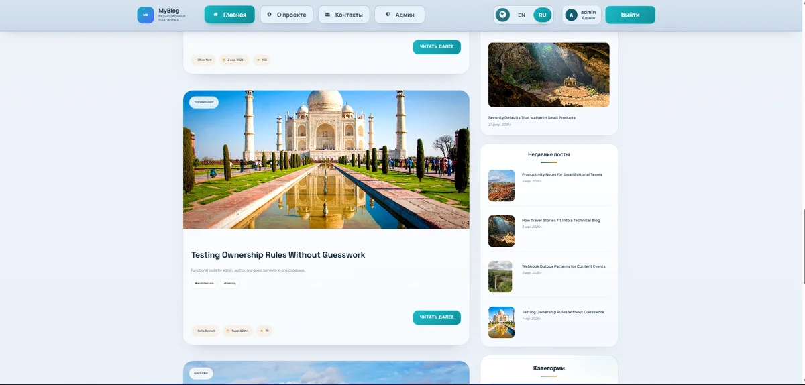
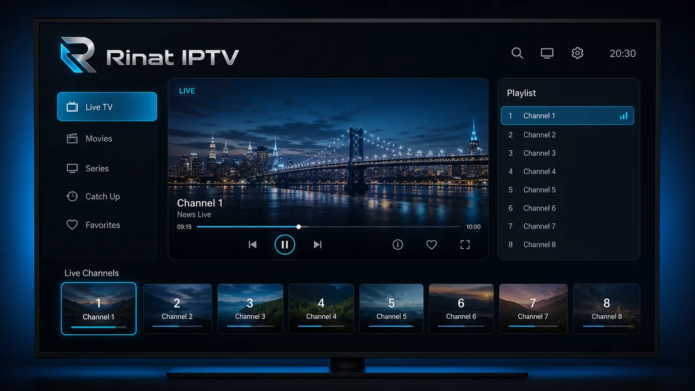
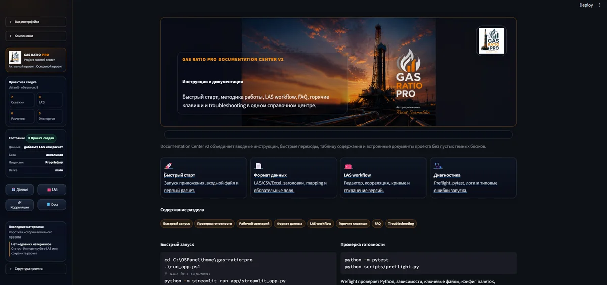
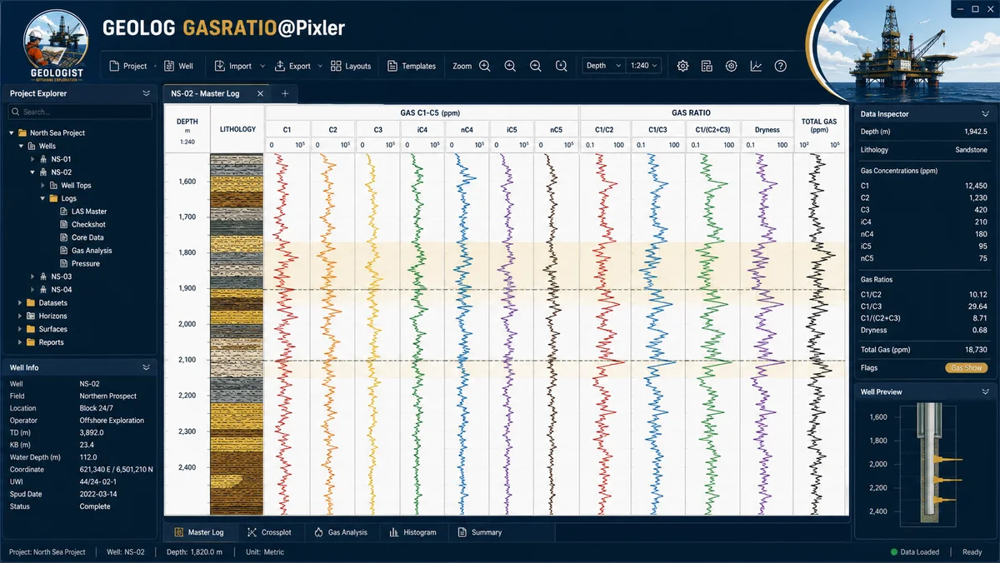
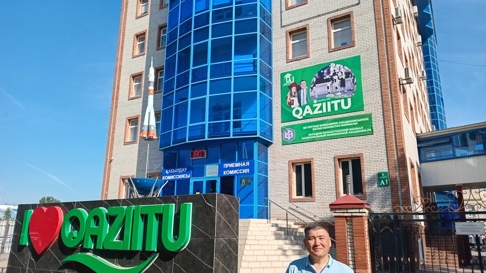

  

  
  
  

---

## About Me / Обо мне

**EN**
I am Rinat Sarmuldin, a fullstack developer from Uralsk, Kazakhstan, with 4+ years of commercial web development experience. My strongest area is PHP backend development: application logic, databases, admin panels, REST APIs, integrations, debugging and deployment support.

I work with practical business systems where the important part is not only to make a page look correct, but also to keep the whole flow reliable: forms, validation, authorization, database records, admin workflows, API contracts, logs and regression checks after changes.

**RU**
Я Ринат Сармулдин, fullstack-разработчик из Уральска, Казахстан. У меня 4+ года коммерческого опыта в веб-разработке. Моя сильная сторона - PHP backend: логика приложения, базы данных, админ-панели, REST API, интеграции, отладка и сопровождение.

Я умею работать с существующими проектами: разобраться в структуре, найти реальную причину ошибки, внести аккуратные изменения и проверить основные сценарии, не переписывая лишнее.

## What I Do Best

- Build and maintain PHP web applications with Laravel, Symfony, Yii2 and Bitrix.
- Design backend logic, REST APIs, admin panels, CRUD flows and integrations.
- Work with MySQL/PostgreSQL: schema, queries, migrations, debugging and data checks.
- Support full web flows: frontend forms, JavaScript behavior, backend validation, database writes and admin output.
- Prepare reproducible local environments with Docker, Docker Compose, Linux and Nginx.
- Debug production-like issues through logs, SQL, recent code changes and server configuration.
- Review changes carefully and test the main user scenarios before considering a task finished.

## Tech Stack

  

| Backend | Frontend | Databases | Infrastructure / Tools |
| --- | --- | --- | --- |
| PHP, Laravel, Symfony, Yii2, Bitrix | HTML, CSS, JavaScript, Vue, React, Nuxt | MySQL, PostgreSQL, SQLite, SQL | Git, Docker, Docker Compose, Linux, Nginx, SSH |
| REST API, API Platform, Sanctum, integrations | Blade, Yii Views, Vite, forms, admin UI | migrations, indexes, query debugging | HTTPS/SSL, domains, hosting, backups, logs |

Also used in projects: Node.js, Express, Sequelize, TypeScript, Kotlin, Jetpack Compose, Room, WorkManager, Hilt, Python, Streamlit.

## Selected Projects

These repositories show the type of systems I like to build: not just small demos, but projects with authentication, roles, admin tools, APIs, documented setup, tests and real maintenance concerns.

<table>
  <tr>
    <td width="50%" valign="top">
      
      

        
      

      
Social platform with feeds, posts, realtime chats, IPTV and radio modules, multilingual routes, admin analytics and OpenAPI documentation.

      
<code>Laravel</code> <code>Vue</code> <code>MySQL</code> <code>Reverb</code> <code>Docker</code>

    </td>
    <td width="50%" valign="top">
      
      

        
      

      
E-commerce platform with a Blade storefront, separate Nuxt frontend, MoonShine admin panel, versioned REST API and complete basket and checkout flows.

      
<code>Laravel</code> <code>Nuxt</code> <code>Vue</code> <code>MoonShine</code> <code>MySQL</code>

    </td>
  </tr>
  <tr>
    <td width="50%" valign="top">
      
      

        
      

      
Online electronics store with catalog search and sorting, currency integration, feedback and admin APIs, payment flow and a reproducible Docker setup.

      
<code>Node.js</code> <code>Express</code> <code>React</code> <code>PostgreSQL</code> <code>Docker</code>

    </td>
    <td width="50%" valign="top">
      
      

        
      

      
Editorial platform with a public site, admin module, user cabinet, API v1, webhook outbox and incoming webhooks, automated tests and Docker tooling.

      
<code>Yii2</code> <code>PHP</code> <code>MySQL</code> <code>Codeception</code> <code>Docker</code>

    </td>
  </tr>
  <tr>
    <td width="50%" valign="top">
      
      

        
      

      
Remote-friendly Android TV application for IPTV playlist discovery, import, editing and playback, with diagnostics and a complete APK build flow.

      
<code>Kotlin</code> <code>Jetpack Compose</code> <code>Media3</code> <code>Room</code> <code>Hilt</code>

    </td>
    <td width="50%" valign="top">
      
      

        
      

      
Engineering workspace for LAS and Excel processing, gas-ratio calculations, explainable interpretation, visual analysis and report preparation.

      
<code>Python</code> <code>Streamlit</code> <code>LAS</code> <code>Excel</code> <code>Data Analysis</code>

    </td>
  </tr>
  <tr>
    <td colspan="2" valign="top">
      

        
      

      

        
      

      
Extensible desktop workstation for LAS, CSV and Excel data, gas logging, lithology, stratigraphy, well correlation, synchronized multi-track plots and masterlog printing.

      
<code>Python</code> <code>PySide6</code> <code>PyQtGraph</code> <code>LAS</code> <code>Gas Ratio</code> <code>Geology</code>

    </td>
  </tr>
</table>

## Academic Portfolio

<table>
  <tr>
    <td width="46%" valign="middle">
      
    </td>
    <td width="54%" valign="middle">
      <h3>Computing Engineering &amp; Software</h3>
      
<strong>Bachelor's Degree · Class of 2026</strong>

      
Kazakhstan University of Innovation and Telecommunication Systems, Uralsk, Kazakhstan.

      

        
        
        
      

      

        
      

    </td>
  </tr>
  <tr>
    <td colspan="2" valign="top">
      
<strong>Portfolio overview</strong>

      
A structured archive of coursework, laboratory assignments, practical projects, examination materials and graduation documents. It shows the academic foundation behind my production work and the progression from core programming concepts to applied software engineering.

      

        
        
        
        
      

      
Coursework · Laboratory work · Web technologies · Databases · Information systems · 3D graphics · Graduation practice

    </td>
  </tr>
</table>

## How I Work

I prefer careful, understandable engineering. Before changing code, I try to understand the existing structure, the database model, the request flow and the reason behind the bug or feature request.

For me, a good change is not only "it works on my screen". It should be readable, safe for existing behavior, easy to review and possible to verify with clear steps. I pay attention to validation, access rules, SQL safety, edge cases, null values and the small details that often become production bugs later.

## Education & Learning

  
  

 

<table>
  <tr>
    <td width="14%" align="center" valign="middle">
       
      Degree
    </td>
    <td width="86%" valign="top">
      <h3>Bachelor's Degree — Computing Engineering &amp; Software</h3>
      
<strong>Kazakhstan University of Innovation and Telecommunication Systems</strong>

      
Completed program <code>6B06114</code> with coursework in programming, databases, web technologies, information systems and applied software engineering.

      
    </td>
  </tr>
  <tr>
    <td width="14%" align="center" valign="middle">
       
      Training
    </td>
    <td width="86%" valign="top">
      <h3>Commercial Software Development — PHP</h3>
      
<strong>iTransition Training Program</strong>

      
Commercial development practices, backend engineering, teamwork, code review and delivery-oriented project work.

      
<code>PHP</code> <code>Backend</code> <code>Code Review</code> <code>Team Workflow</code>

    </td>
  </tr>
  <tr>
    <td width="14%" align="center" valign="middle">
       
      Infrastructure
    </td>
    <td width="86%" valign="top">
      <h3>Linux Operations &amp; DevOps Basics</h3>
      
Linux administration fundamentals, deployment environments, web server configuration and practical infrastructure workflows.

      
<code>Linux</code> <code>Nginx</code> <code>Deployment</code> <code>Server Operations</code>

    </td>
  </tr>
  <tr>
    <td width="14%" align="center" valign="middle">
       
      Development
    </td>
    <td width="86%" valign="top">
      <h3>Backend &amp; Web Development Track</h3>
      <ul>
        <li><strong>Laravel 10 for REST APIs</strong> — API design, application structure and backend development.</li>
        <li><strong>Bitrix Framework Developer</strong> — framework development certificate.</li>
        <li><strong>WebCademy</strong> — frontend development and PHP website development.</li>
        <li><strong>Git &amp; GitHub</strong> — version control and collaborative repository workflows.</li>
      </ul>
      
<code>Laravel</code> <code>REST API</code> <code>Bitrix</code> <code>PHP</code> <code>Git</code>

    </td>
  </tr>
  <tr>
    <td width="14%" align="center" valign="middle">
       
      Foundation
    </td>
    <td width="86%" valign="top">
      <h3>Docker &amp; Practical SQL</h3>
      
Container-based development environments and hands-on relational database querying.

      
<code>Docker</code> <code>Docker Compose</code> <code>SQL</code> <code>Databases</code>

    </td>
  </tr>
</table>

## Languages

| Language | Level |
| --- | --- |
| Kazakh | Native |
| Russian | C2 |
| English | B2 |

## GitHub Activity

  

  

## Contact

I am open to full-time work, remote work and on-site opportunities where my PHP/backend and fullstack experience can be useful.

  
  
  

  Uralsk, Kazakhstan

